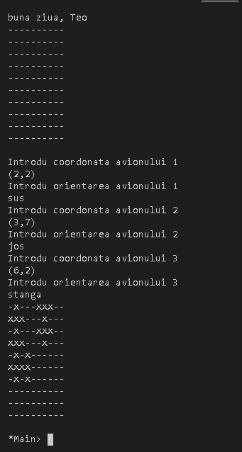
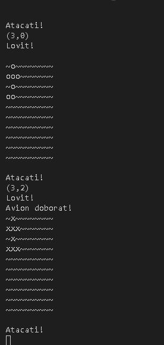

# BattlePlanes

# About

Scopul acestui proiect a fost de a realiza în limbaj Haskell jocul de strategie “Avioane” ce se va putea juca împotriva unui AI cât mai competent cu putință.
Jocul va presupune o interfață cât de cât prietenoasă în consolă (deoarece scopul principal a fost AI-ul și nu interfață), posibilitatea utilizatorului de a plasa avioane pe coordonate și orientare și posibilitatea de a ghici coordonatele avioanelor adverse. Jucătorul va fi notificat la fiecare mișcare a sa dacă a nimerit sau ratat, cât și la fiecare mișcare a computerului. În momentul în care unul dintre jucători (uman sau bot) vor rămâne fără avioane pe tablă, jocul se va încheia

# Aspecte cheie ale proiectului

Dezvoltarea “gândirii” AI-ului a reprezentat o parte a proiectului pentru care a trebuit să investesc mai multe resurse. Modul de alegere al unei coordonate de atac, urmărirea distrugerii unui avion lovit, evitarea coordonatelor folosite - toate acestea, cât și logica jocului, coerența acestuia, au fost puncte de mare interes pentru mine cât și elemente de o dificultate mai ridicată.

În plus, definirea tuturor utilitarelor necesare și mai apoi punerea cap la cap a acestora a reprezentat o provocare de sine stătătoare deoarece a trebuit să stăpânesc destul de bine cunoștințele în Haskell.

# Gameplay lol

Introducerea avioanelor pe tabla de joc

Distrugerea unui avion inamic

